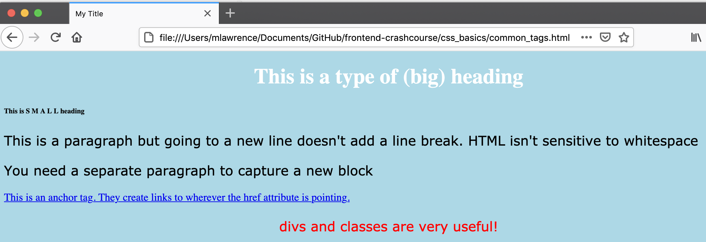
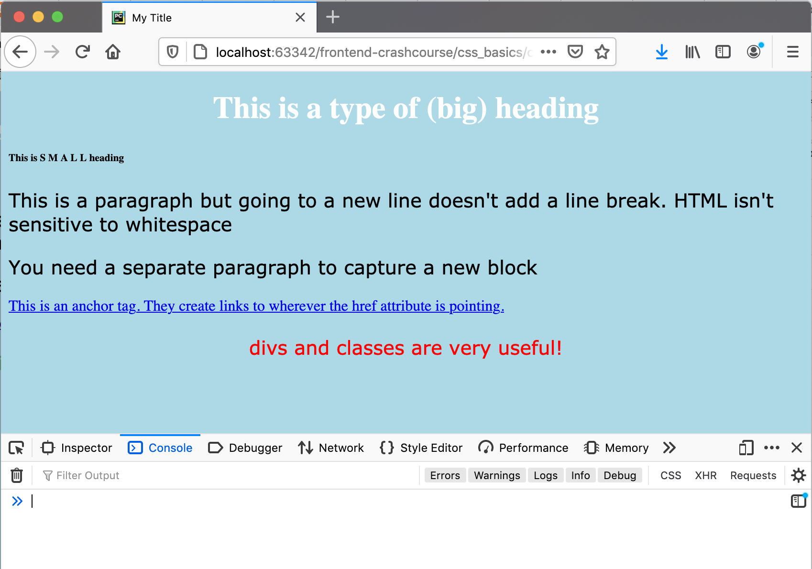
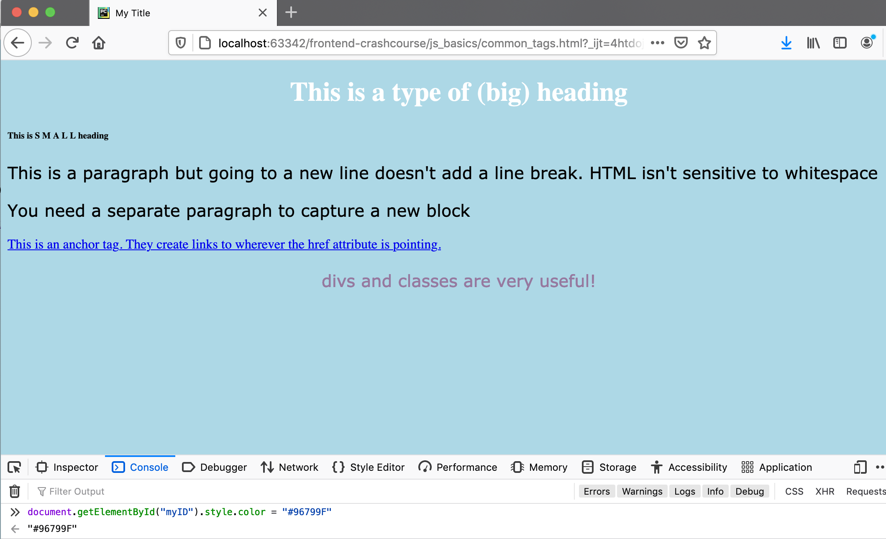
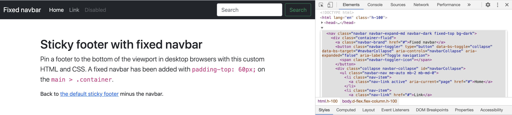
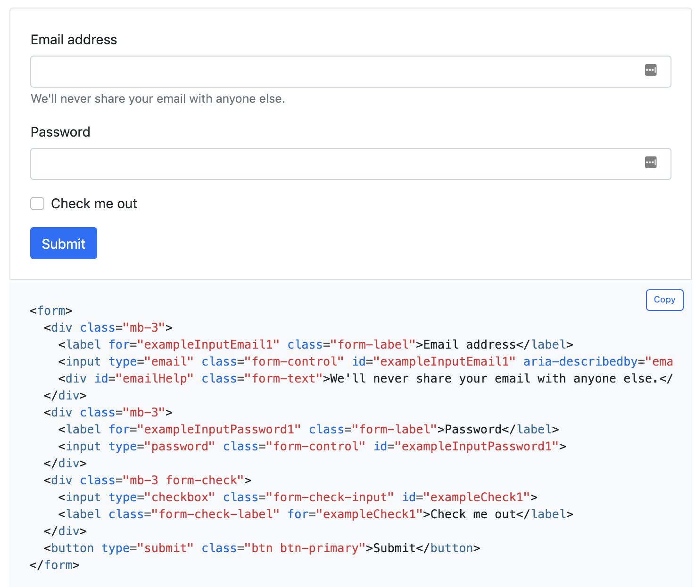

# Frontend Crash course

Frontend roughly means all of the code that goes into making a visual layer for your users, like a website. The standard way of making a web interface is by using HTML, then optionally some combination of CSS, javascript, and a backend that inserts relevant information into your HTML to make it more interactive and pretty.

### The DOM (Document-Object Model)
The DOM is the standard for thinking about frontend. The main idea of the DOM is that every webpage is represented by a HTML document that gives the basic structure, such as titles, paragraphs, tables of information, lists, forms, and so on. Any other code that wants to add interactivity to the page or make it more pretty can edit the document object to meet that goal.

 


### HTML: The Bread and Butter of Frontend 
HTML is at the core of everything. It is the Document that forms the Document Object. It gives all of the structure to your webpage. A minimal webpage in HTML would look like,
```html
<!DOCTYPE html>
<html lang="en">
<head>
    <meta charset="UTF-8">
    <title>Title</title>
</head>
<body>
  <!--Your HTML code goes here-->
  <h1>This is my website!</h1>
</body>
</html>
```

Note that everything in HTML uses tags as building blocks. Tags look like, 

```html
<tag_name> This is wrapped by the tag called tag_name. </tag_name>
```

Many useful tags with examples can be found at [W3Schools' website.](https://www.w3schools.com/html/default.asp) 

Here is a HTML document with some common tags,

```html
<!DOCTYPE html>
<html lang="en">
<head>
    <meta charset="UTF-8">
    <title>Title</title>
</head>
<body>
  <!--This is a comment-->
  <h1>This is a type of (big) heading</h1>
  <h6>This is  S M A L L heading</h6>

  <p> This is a paragraph
  
      but going to a new line doesn't add a line break. HTML isn't sensitive to whitespace</p>
      
  <p> You need a separate paragraph to capture a new block</p>
  
  <a href="https://www.google.com">This is an anchor tag. They create links to wherever the href attribute is pointing.</a>
  
  
<div class="myClass">
    <p id="myID">divs and classes are very useful!</p>
</div>
  
  </body>
</html>
```

`div` tags create a container that isolates the inner HTML. This can be useful if you want to treat a section of your website in a special way - say coloring all of the inner text red. The `class="myClass"` attribute of the div tag can be used to locate this particular section since the name "myClass" is arbitrary. You can name classes whatever you'd like. `id`s function the same way, though they should be unique, while classes can be shared across many tags. We'll come back to this when we talk about CSS.


#### Viewing HTML in the browser
To view HTML on your computer, you need to open the file in your browser. To do this, copy the full path to your html file and paste it in your browser. For example, the above HTML snippet is saved in `html_basics/common_tags.html`, which has the full path `/Users/mlawrence/Documents/GitHub/frontend-crashcourse/html_basics/common_tags.html` on my computer. We can paste this full path in Firefox or Chrome to look at our HTML file. 

After doing this, you should see something like the following:


### CSS: Adding style to your HTML

CSS, or cascading style sheets, is the standard way of adding style to your HTML document. With CSS, you can indicate color, position, font, and more. Per [W3 School's website](https://www.w3schools.com/css/), a simple `.css` file might look like:
```css
body {
  background-color: lightblue;
}

h1 {
  color: white;
  text-align: center;
}

p {
  font-family: verdana;
  font-size: 20px;
}
```

Notice that each block starts with a HTML tag type. The material in the curly brackets tells your browser how to style all elements of the type indicated at the start. For example, all `h1` tags should have the color white and have their text center-aligned.

Beyond HTML tags, you can use CSS to style by HTML `class` and `id` as well. Consider a HTML file with a class called "myClass" and an id called "myID". You could style elements having these respective attributes like,
```css
/* use # to select IDs and . to select classes */

#myID {
  color: red;
}

.myClass {
  text-align: center;
}

```


While you can indicate the style you want directly in your HTML file, making a separate `.css` file is more typical. 

#### Connecting your .css file to the HTML file

Connecting a .css file is pretty straightforward. For each .css file you'd like to include, you must add `link` tag in your HTML file's header to tell your HTML where to look for the file. 

Consider an HTML file in the same directory as a file called `basic.css`. We can link `basic.css` into our HTML file by adding the `link` tag inside our `<head>` tags like so,

```html
<head>
    <meta charset="UTF-8">
    <title>My Title</title>
    <link rel="stylesheet" href="basic.css">
</head>
```

### HTML + CSS: The final product

If you look at [the css basics folder](./css_basics), you should find an example HTML file with linked css. Playing with these is a good idea to get familiar with how these files interact. If you open the HTML file in a browser, you should see this:


Notice that the bottom text, "divs and classes are very useful", is styled differently from everything else. This is because we used HTML classes and IDs to select those elements and give them specific styling. If we look at the css file, `#myID` and `.myClass` are called out explicitly to give them custom styling.

```css
/* use # to select IDs and . to select classes */

body {
  background-color: lightblue;
}

h1 {
  color: white;
  text-align: center;
}

p {
  font-family: verdana;
  font-size: 20px;
}

#myID {
  color: red;
}

.myClass {
  text-align: center;
}
```

### Javascript briefly

Javascript, or js, is a programming language that allows you to easily create interactive webpages by modifying the DOM in real time. In other words, you can change the HTML elements and their styling on the fly quite easily. 

A popular way of modifying elements in the DOM is by referencing the ID or class of the element(s) you'd like to change. JS allows you to then modify attributes on these elements, such as changing color or hiding some elements when someone clicks on an elements. JS can be ran in the inspect console of most popular web browsers. Here's an example of using js to change the DOM on the fly:

##### Before


#####After


Notice that the JS code directly grabs the DOM by using the `document` variable, which then allows you to modify the element that has `id` of `myID`.

Javascript code should usually be placed in a separate file and linked into your HTML file. Consider the following file, `myFunctions.js` that takes the above code and makes it a separate JS function:

```javascript
function changeToPurple(){
  document.getElementById("myID").style.color = "#96799F"
}
```


##### Including JS in HTML for interactivity

We can link this into the HTML like by wrapping it in
`<script>` tags like,

```html
<script src="myFunctions.js"></script>
```

Additionally, we can make the page interactive by having this function run when a user clicks an element, which HTML supports with the `onclick` attribute, like this:

```html
<p id="myID" onclick="changeToPurple()">divs and classes are very useful!</p>
```

### Bootstrap: Building a great demo as lazily as possible

This is where the fun starts. HTML, CSS, and JS are great for understanding how things work, and there are times where you must build your own custom frontend components, but that takes a lot of time when you want to make a prototype. [Bootstrap](https://getbootstrap.com/) is a CSS + JS library and component library that you can use to piece together a prototype very rapidly.


##### Including bootstrap in your own code
To include bootstrap in your HTML code, simply add the following to the bottom of your HTML body (these are on the front page of Bootstrap's website. Grab the newest links there if necessary).
```html
<!-- CSS only -->
<link href="https://cdn.jsdelivr.net/npm/bootstrap@5.0.0-beta2/dist/css/bootstrap.min.css" rel="stylesheet" integrity="sha384-BmbxuPwQa2lc/FVzBcNJ7UAyJxM6wuqIj61tLrc4wSX0szH/Ev+nYRRuWlolflfl" crossorigin="anonymous">
<!-- JavaScript Bundle with Popper -->
<script src="https://cdn.jsdelivr.net/npm/bootstrap@5.0.0-beta2/dist/js/bootstrap.bundle.min.js" integrity="sha384-b5kHyXgcpbZJO/tY9Ul7kGkf1S0CWuKcCD38l8YkeH8z8QjE0GmW1gYU5S9FOnJ0" crossorigin="anonymous"></script>
```

What these do is link in a bunch of great CSS defaults for HTML you write, and allow you to copy and paste components from Bootstrap's documentation and have them work off the shelf. 


##### Bootstrap Themes and Components

Bootstrap has many [great examples](https://getbootstrap.com/docs/5.0/examples/) of user interfaces and components that can be pieced together for your demos. Consider the [navigation bar theme example](https://getbootstrap.com/docs/5.0/examples/sticky-footer-navbar/) from their documentation. If we use our browser's inspection tool, we can snip out the html and it should just work on our own site.



Additionally, Bootstrap has any examples of individual components that are meant to be copied and pasted. Consider the [forms page](https://getbootstrap.com/docs/5.0/forms/overview/#overview), where there are great forms ready for you to use.




## Wrapping things up

These ideas are building blocks. When making a demo or proof of concept, you shouldn't feel like you have to use the most complex solution out there - copying some bootstrap code and modying it for your own purposes is often more than enough. If you want to make a more serious application, the HTML, CSS, and JS will always be available to build off of. 

Happy coding!